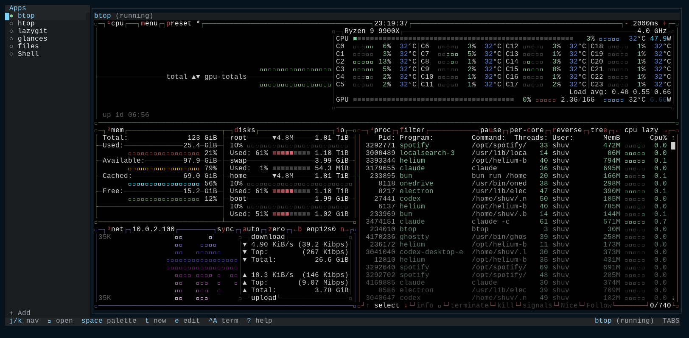
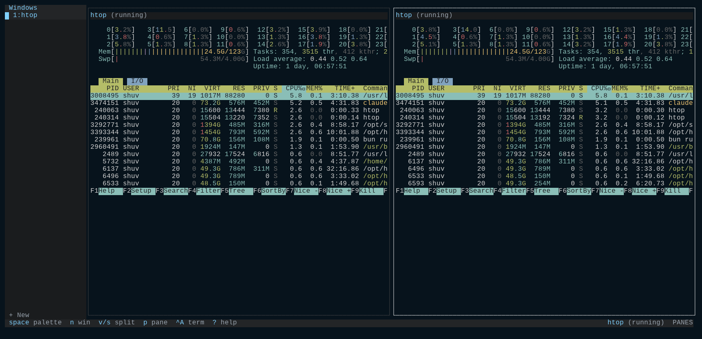
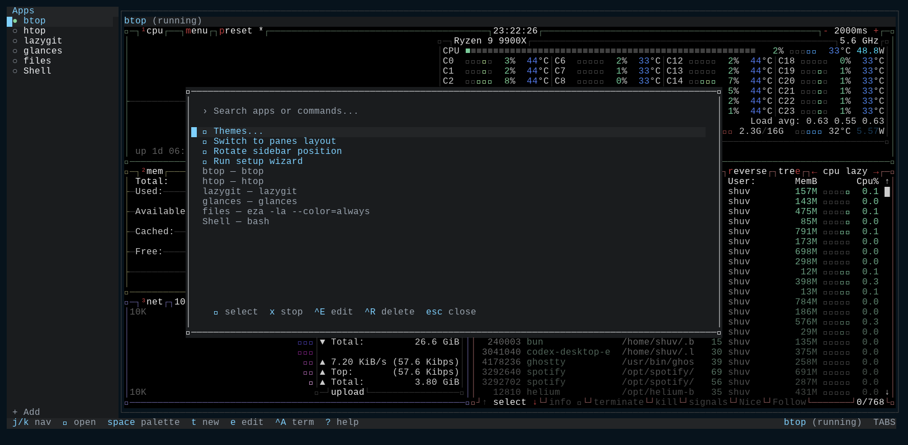
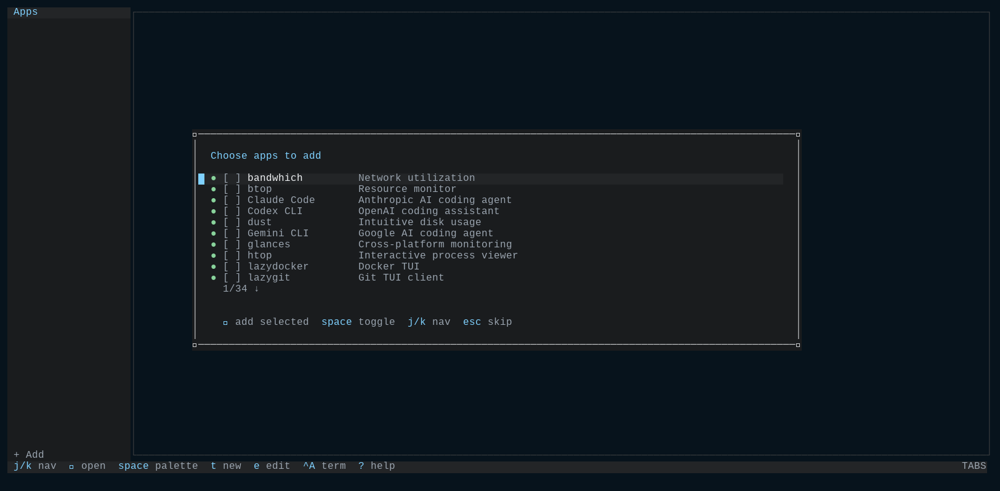
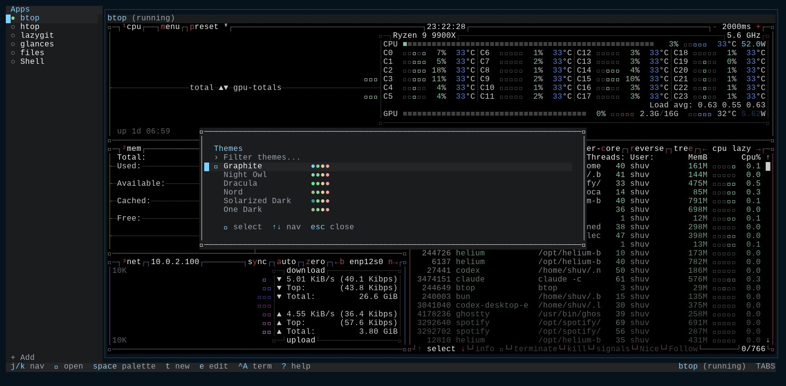
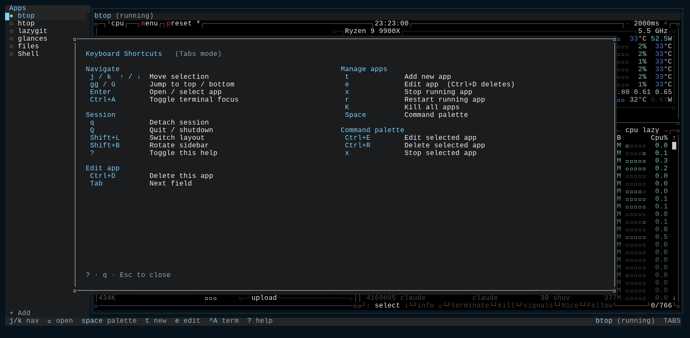
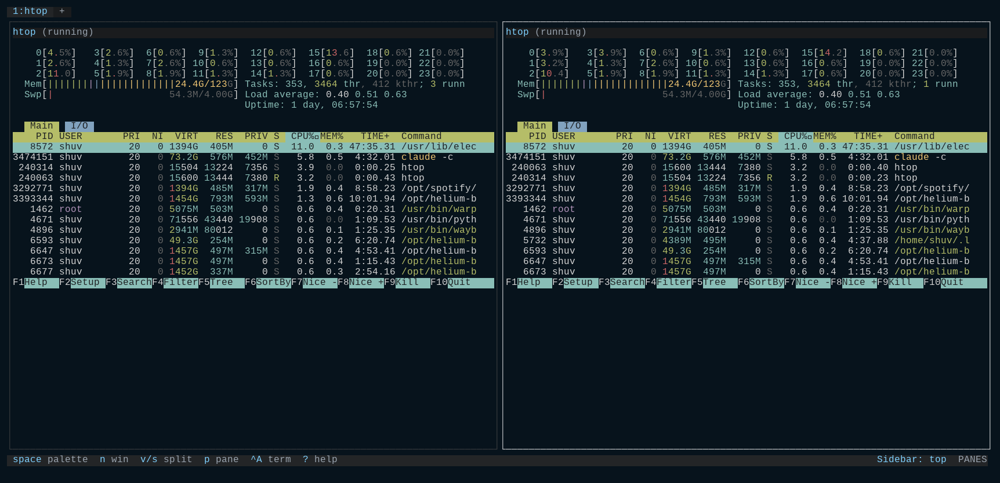

# tuimux

A centralized TUI multiplexer for running multiple terminal applications in embedded terminal windows. Pick a **tabs** layout (a task-list sidebar plus one active app) or a tmux/zellij-style **panes** layout (tiled, split-able windows) — and switch between them live. Built with [OpenTUI](https://github.com/anomalyco/opentui) and SolidJS.

## Screenshots

### Tabs mode

The default layout: a task-list sidebar of your apps on the left, with the active app (here, `btop`) running in a full embedded terminal.



### Panes mode

A tmux/zellij-style tiled layout — split windows into multiple panes and watch several apps at once (here, two `htop` panes), with a window-list sidebar for navigation.



### Command palette

Press `Space` to fuzzy-search apps, global commands (switch layout, rotate sidebar, run the setup wizard, pick a theme) and per-app actions.



### First-run onboarding

On first launch with no apps configured, a welcome wizard lets you multi-select from a list of app presets.



### Theme picker

Nine built-in themes with live swatches, switchable on the fly.



### Keyboard cheatsheet

Press `?` anytime for the built-in keyboard cheatsheet.



### Rotatable task list

The task list can live on any edge — left, right, top, or bottom (`Shift+B`). Here it sits as a horizontal top bar in panes mode.



## Features

- **Two Layout Modes**: A **tabs** layout (task-list sidebar + one active app in an embedded terminal) and a tmux/zellij-style **panes** layout (tiled, split-able windows with multiple apps visible at once). Set `layout: tabs | panes` in config.
- **Runtime Layout Switching**: Toggle tabs ⇄ panes live with `Shift+L` (or the command palette) — the session restarts in the target layout and replays your running apps.
- **Rotatable Task List**: Put the sidebar on any edge — left, right, top, or bottom — with `Shift+B`. Left/right give a vertical sidebar; top/bottom give a horizontal bar. Works in both layouts.
- **Embedded Terminals**: Run multiple TUIs in a single window using Ghostty's high-performance terminal emulator.
- **First-Run Onboarding Wizard**: A welcome screen and multi-select app-preset picker appears on first launch when nothing is configured. Re-run anytime from the command palette.
- **Command Palette**: Fuzzy-search apps, global commands, and per-app actions (switch/start, stop, edit, remove) with `Space`.
- **Nine Built-in Themes**: Graphite (default), Night Owl, Dracula, Nord, Solarized Dark, One Dark, Catppuccin Mocha, Gruvbox Dark, and Tokyo Night — switch live, or define your own.
- **Simple Modal Keyboard**: A control focus for navigation (shown as TABS or PANES) and a TERMINAL focus that passes all keys to the embedded PTY. Toggle with `Ctrl+A`. `Ctrl+C` always passes through to the focused app — it never quits tuimux.
- **Runtime Management**: Add, edit, and remove application entries directly within the app without restarting.
- **Session Persistence**: Optional config to remember and restore running applications and the active app between restarts.
- **App Availability Detection**: The Add modal and onboarding wizard show which of 30+ TUI presets (including AI coding agents) are installed on your system.
- **Highly Configurable**: Customize layout, themes, sidebar position, and application lists via YAML.
- **Path Expansion**: Supports `~`, `<CONFIG_DIR>`, and `<STATE_DIR>` tokens in paths.

## Documentation

For detailed guides, see the [`docs/`](./docs/) directory:

- [Getting Started](./docs/getting-started.md) - Installation and first run
- [Configuration](./docs/configuration.md) - YAML config reference
- [Apps](./docs/apps.md) - App configuration examples
- [Troubleshooting](./docs/troubleshooting.md) - Common issues and solutions

See also: [CONFIG.md](./CONFIG.md) for a comprehensive configuration reference.

### Dependency security

tuimux uses Bun as its package manager. Bun installs are not covered by Socket's CLI wrapper (which supports npm/pnpm/yarn/npx only). The [Socket GitHub App](https://github.com/apps/socket-security) handles PR-level dependency scanning instead. See [SECURITY.md](./SECURITY.md) for details.

## Tech Stack

- **Runtime**: [Bun](https://bun.sh/)
- **Framework**: [SolidJS](https://www.solidjs.com/)
- **TUI Engine**: [OpenTUI](https://github.com/anomalyco/opentui)
- **Terminal Emulator**: [ghostty-opentui](https://github.com/remorses/ghostty-opentui)
- **PTY**: `node-pty` (via `spawn-pty`)

## Getting Started

### Prerequisites

- [Bun](https://bun.sh/) runtime installed on your system.
- A terminal that supports TUI applications (xterm-256color recommended).

### Quick Start (No Install)

Run tuimux instantly without installing:

```bash
bunx tuimux
```

### Installation

Install globally:

```bash
bun install -g tuimux
```

Then run from anywhere:

```bash
tuimux
```

## Development

Clone the repository and install dependencies:

```bash
git clone https://github.com/shuv1337/tuimux.git
cd tuimux
bun install
```

Start the application in development mode:

```bash
bun dev
```

Build for production:

```bash
bun run build
```

Run typechecks:

```bash
bun run typecheck
```

## Configuration

Tuimux looks for a configuration file at `~/.config/tuimux/tuimux.yaml`. It also supports a local `tuimux.yaml` in the current working directory for project-specific setups. On first run with no config, tuimux auto-migrates an existing `~/.config/tuidoscope` config and session if one is present.

Set the layout with `layout: tabs | panes` (default `tabs`; legacy values `classic` → tabs and `zellij` → panes are still accepted) and the sidebar edge with `sidebar_position: left | right | top | bottom` (default `left`).

### Keyboard Shortcuts

Focus is split between a **control** focus for navigation (shown as **TABS** in tabs mode, **PANES** in panes mode) and a **TERMINAL** focus that passes every key to the embedded PTY.

- **`Ctrl+A`** - Toggle between control focus and TERMINAL focus
- **Double-tap `Ctrl+A`** - Send a literal `Ctrl+A` to the terminal (useful for nested tmux/screen)
- **`Ctrl+C`** - Always passes through to the focused app; it never quits tuimux

**TERMINAL focus**: all keystrokes pass through to the embedded terminal.

**TABS-mode control keys** (single keystrokes):

| Key | Action |
|-----|--------|
| `j` / `k` (or `↑` / `↓`) | Navigate down/up in the task list |
| `gg` | Jump to first app |
| `G` | Jump to last app |
| `Enter` | Open / start selected app |
| `Space` | Open command palette |
| `t` | Add new app |
| `e` | Edit selected app |
| `x` | Stop selected app |
| `r` | Restart selected app |
| `K` | Kill all running apps |
| `q` | Detach (leave apps running) |
| `Q` | Quit and shut down |
| `?` | Help cheatsheet |
| `Shift+L` | Switch layout (tabs/panes) |
| `Shift+B` | Rotate sidebar position (left → top → right → bottom) |

**PANES-mode control keys** (single keystrokes):

| Key | Action |
|-----|--------|
| `v` | Split current pane vertically |
| `s` | Split current pane horizontally |
| `n` | New window |
| `w` | Close window |
| `x` | Close pane |
| `[` / `]` | Previous / next window |
| `p` | Cycle pane |
| `t` | Add new app |
| `Space` | Open command palette |
| `q` | Detach (leave apps running) |
| `Q` | Quit and shut down |
| `?` | Help cheatsheet |
| `Shift+L` | Switch layout (tabs/panes) |
| `Shift+B` | Rotate sidebar position |

See [CONFIG.md](./CONFIG.md) for the full keybinding and configuration reference.

### Theme Customization

The default theme is **Graphite**. Tuimux ships nine built-in themes — Graphite, Night Owl, Dracula, Nord, Solarized Dark, One Dark, Catppuccin Mocha, Gruvbox Dark, and Tokyo Night — which you can switch live from the command palette (`Space` → "Themes…").

A custom theme is a 5-token palette; the rich UI palette is derived from those tokens at runtime. Example (a Night Owl palette) in your `tuimux.yaml`:

```yaml
theme:
  primary: "#82aaff"      # Blue - selections
  background: "#011627"   # Deep dark blue
  foreground: "#d6deeb"   # Light text
  accent: "#7fdbca"       # Cyan - active indicators
  muted: "#637777"        # Gray - inactive elements
```

## Change Log

### v0.5.0
- **Rotatable / Horizontal Task List**: The task list can now sit on any edge — left, right, top, or bottom. Cycle positions with `Shift+B` (or the command palette); top/bottom render it as a horizontal bar. Configurable via `sidebar_position`.
- **First-Run Onboarding Wizard**: A welcome screen and multi-select app-preset picker appears on first launch when no config and no apps exist. Esc skips it, an `onboarding_completed` flag keeps it from reappearing, and it can be re-run anytime from the palette ("Run setup wizard").
- **Runtime Layout Switching**: Toggle tabs ⇄ panes live with `Shift+L` — the session server restarts in the target layout and replays running apps. Includes correctness fixes so apps and focus survive the switch.
- **Dependency-Security Docs**: Documented the Bun + Socket GitHub App security posture in [SECURITY.md](./SECURITY.md).

### v0.4.0
- **Rebranded to tuimux**: Project renamed from tuidoscope to tuimux.
- **Layout Mode Rename**: "classic" layout is now "tabs"; "zellij" layout is now "panes". Legacy values still accepted.
- **Panes Mode Window Sidebar**: In panes layout, a window list sidebar replaces the tab list for managing windows.
- **Switch Layout Keybind**: Press `Shift+L` in non-terminal focus to toggle between tabs and panes layout.
- **Switch Layout Command Palette**: "Switch layout" command added to the command palette.

### v0.3.0
- **Simplified Keyboard System**: Replaced tmux-style leader key with simple focus-toggle model using `Ctrl+A`.
- **Two-Mode Interface**: TABS mode for navigation (single keystrokes) and TERMINAL mode for PTY input.
- **Enhanced Add Tab Modal**: Now shows app presets with availability detection directly in the modal.
- **Streamlined Config**: Removed keybinds configuration - keyboard shortcuts are now fixed for consistency.

### v0.2.0
- **Leader Key System**: tmux-style configurable leader key (default `Ctrl+A`).
- **App Availability Detection**: Preset list shows which apps are installed on your system.
- **Expanded Presets**: 30+ TUI apps including AI coding agents (Claude, OpenCode, Aider, Gemini, Codex).
- **Night Owl Theme**: Updated default theme to Night Owl color scheme.

### v0.1.0
- Initial release.
- Embedded terminal windows via `ghostty-opentui`.
- Vertical tab sidebar for application management.
- Command palette with fuzzy search.
- Optional session persistence (running apps & active tab).
- Runtime application configuration (Add/Edit).
- Path expansion for working directories.

## Contributing

Contributions are welcome! Please feel free to open an issue or submit a pull request on [GitHub](https://github.com/shuv1337/tuimux).

## Acknowledgments

This project is built directly on top of:

- **[OpenTUI](https://github.com/anomalyco/opentui)** - Provides the declarative component model and rendering engine for the entire interface.
- **[ghostty-opentui](https://github.com/remorses/ghostty-opentui)** - Enables high-performance, embedded terminal sessions within the application.

Huge thanks to both for making this possible.

## License

MIT
